**Intelligent toxicity detection, analysis, and mitigation system using transformer-based models with universal system optimization.**

## 🎯 Overview

The AI section provides a complete pipeline for processing toxic language through:
- **Classification**: Advanced toxicity detection using Detoxify
- **Reasoning**: Rule-based logical refinement of toxicity scores  
- **Paraphrasing**: Intelligent text rewriting with multi-criteria ranking
- **Analysis**: Full pipeline orchestration

**Key Features:**
- 🌍 **Universal Compatibility**: Automatically optimizes for any system (Windows/Linux/macOS, CPU/GPU)
- ⚡ **Auto-Adaptive Performance**: Adjusts parameters based on hardware capabilities
- 🏗️ **Microservices Architecture**: Scalable, independent services
- 🧠 **Advanced Reasoning**: Rule-based toxicity score refinement
- 🎯 **Multi-Criteria Ranking**: Toxicity + Similarity + Fluency optimization

## 🚀 Quick Start

### 1. Universal Setup
```bash
# Clone and navigate to project
git clone <your-repo>
cd ToxicRadar

# Run universal setup (works on any system)
python3 -m venv venv
source venv/bin/activate
chmod +x AI/universal_startup.sh
./AI/universal_startup.sh
```

The setup script automatically:
- Detects your OS and hardware
- Creates optimized virtual environment
- Installs dependencies (PyTorch optimized for your system)
- Tests installation
- Creates project structure

### 2. Start Services

**Individual Services:**
```bash
# Classification Service (Port 8001)
python -m uvicorn AI.classifier.classifier:app --host 0.0.0.0 --port 8001

# Reasoning Service (Port 8002)  
python -m uvicorn AI.reasoning.reasoning:app --host 0.0.0.0 --port 8002

# Paraphrasing Service (Port 8000)
python -m uvicorn AI.paraphraser.service:app --host 0.0.0.0 --port 8000

# Analysis Service (Port 8003)
python -m uvicorn AI.analyze.service:app --host 0.0.0.0 --port 8003
```

**Main Service (Recommended):**
```bash
# Starts the complete paraphrasing service
python -m uvicorn AI.paraphraser.service:app --host 0.0.0.0 --port 8000
```

### 3. Test the System

```bash
# Test single text paraphrasing
curl -X POST "http://localhost:8000/paraphrase" \
  -H "Content-Type: application/json" \
  -d '{"text": "You are such an idiot!", "num_candidates": 3}'

# Check system health
curl "http://localhost:8000/health"
```

## 🏗️ Architecture & Flow

### System Flow Diagram

```mermaid
flowchart TD
    Start([🚀 universal_startup.sh]) --> SystemDetect[🔍 System Detection<br/>OS, GPU, Memory Analysis]
    SystemDetect --> VenvSetup[📦 Environment Setup<br/>Virtual env + Dependencies]
    VenvSetup --> CoreInit[🧠 Core Initialization<br/>Hardware optimization]
    CoreInit --> ModelLoad[🤖 Model Loading<br/>T5 + Detoxify models]
    ModelLoad --> Services{🚀 Services}
    
    Services --> Classifier[📊 Classification Service<br/>Toxicity detection]
    Services --> Reasoning[🧮 Reasoning Service<br/>Rule-based refinement]
    Services --> Paraphrasing[📝 Paraphrasing Service<br/>Text generation + ranking]
    Services --> Analysis[🔄 Analysis Service<br/>Pipeline orchestrator]
    
    Paraphrasing --> UserRequest[👤 User Request]
    UserRequest --> Generation[🎯 Text Generation]
    Generation --> Scoring[🔍 Multi-Criteria Scoring]
    Scoring --> Ranking[🏆 Candidate Ranking]
    Ranking --> Response[✨ Final Response]
```



### Processing Pipeline

For each text input, the system:

1. **🔍 Classification**: Detoxify model detects toxicity levels
2. **🧮 Reasoning**: Rule engine applies logical constraints
3. **🎯 Generation**: T5 model creates multiple paraphrases  
4. **📊 Scoring**: Each candidate scored for:
   - **Toxicity**: Using Detoxify + reasoning rules
   - **Similarity**: Semantic similarity to original (Sentence-BERT)
   - **Fluency**: Language quality (T5 perplexity)
5. **🏆 Ranking**: Weighted utility score: `(1-toxicity)×0.5 + similarity×0.3 + fluency×0.2`
6. **✨ Response**: Best candidates returned with detailed metadata

## 📁 Project Structure

```
AI/
├── universal_startup.sh          # Universal setup script
├── requirements.txt              # Dependencies
├── core/
│   ├── __init__.py
│   └── system_detector.py        # Hardware detection & optimization
├── classifier/
│   ├── __init__.py
│   ├── classifier.py             # Toxicity classification service
│   └── service.py                # Test client
├── reasoning/
│   ├── __init__.py
│   ├── reasoning.py              # Reasoning service
│   └── logic.py                  # Rule engine
├── paraphraser/
│   ├── __init__.py
│   ├── service.py                # Main paraphrasing service
│   ├── shared_model.py           # Universal model manager
│   ├── generator.py              # Text generation
│   ├── scorer.py                 # Multi-criteria scoring
│   └── voting.py                 # Ranking algorithms
└── analyze/
    ├── __init__.py
    └── service.py                # Analysis orchestrator
```

## 🔧 Services & APIs

### 1. Classification Service (`classifier.py`)
**Port**: 8001

```python
POST /classify              # Single text classification
POST /classify_batch        # Batch processing  
GET  /health               # Service status
GET  /info                 # Service information
```

**Example**:
```bash
curl -X POST "http://localhost:8001/classify" \
  -H "Content-Type: application/json" \
  -d '{"text": "You are terrible!"}'
```

### 2. Reasoning Service (`reasoning.py`)
**Port**: 8002

```python
POST /reason               # Apply logical rules to toxicity scores
```

**Rule Examples**:
- `identity_attack > 0.1` → Force `toxicity = 0.9`
- `severe_toxicity > 0.3` → Ensure `toxicity ≥ severe_toxicity`
- `threat > 0.3` → Set `toxicity = 0.8`

### 3. Paraphrasing Service (`service.py`) 
**Port**: 8000 (Main Service)

```python
POST /paraphrase           # Single text paraphrasing
POST /paraphrase_batch     # Batch processing
POST /paraphrase_advanced  # Advanced controls
GET  /health              # System status
GET  /system_info         # Comprehensive system info
GET  /capabilities        # System capabilities
```

**Generation Modes**:
- `auto`: Automatically selects best mode for your system
- `efficient`: Memory-efficient for resource-constrained systems
- `quality`: High-quality for powerful systems  
- `universal`: Balanced approach

### 4. Analysis Service (`service.py`)
**Port**: 8003

```python
POST /analyze             # Full pipeline: Classification + Reasoning
```

## ⚙️ System Optimizations

### Automatic Hardware Detection

The system automatically detects and optimizes for:

**CUDA (NVIDIA GPU)**:
- Float16 precision for memory efficiency
- GPU memory management and batch optimization
- CUDA autocast for performance

**MPS (Apple Silicon)**:
- Metal Performance Shaders optimization
- Float32 for stability
- Shared memory management

**CPU**:
- Multi-threading optimization
- Conservative memory usage
- Efficient batch processing

### Performance Adaptations

| System Type | Batch Size | Workers | Max Candidates | Memory Mode |
|-------------|------------|---------|----------------|-------------|
| High-end GPU (≥12GB) | 16 | 8 | 20 | Float16 |
| Mid-range GPU (8-12GB) | 8 | 6 | 15 | Float16/32 |
| Low-end GPU (<8GB) | 4 | 4 | 10 | 8-bit/4-bit |
| High-end CPU (≥32GB RAM) | 8 | 8 | 15 | Float32 |
| Standard CPU (16-32GB) | 4 | 4 | 10 | Float32 |
| Low-end CPU (<16GB) | 2 | 2 | 6 | Float32 |

## 🧠 Advanced Features

### Rule-Based Reasoning Engine

The reasoning system applies logical constraints to ensure consistency:

```python
# Example rules from logic.py
def identity_attack_rule():
    return {
        "condition": lambda labels: labels["identity_attack"] > 0.1 and labels["toxicity"] < 0.5,
        "action": lambda labels: labels.update({"toxicity": 0.9}),
        "explanation": "identity_attack > 0.1 → forced toxicity = 0.9"
    }
```

### Multi-Criteria Ranking

Candidates are ranked using a weighted utility function:

```python
utility_score = (1 - toxicity) * 0.5 + similarity * 0.3 + fluency * 0.2
```

Alternative ranking methods available:
- **Weighted Voting**: Multiple voting strategies
- **Adaptive Scoring**: Context-dependent weights
- **Borda Count**: Rank-based voting
- **Copeland Method**: Pairwise comparisons

### Memory Management

- **Adaptive Caching**: LRU caches sized based on available RAM
- **Model Sharing**: Single model instance across services
- **Automatic Cleanup**: Device-specific memory clearing
- **Resource Monitoring**: Real-time usage tracking

## 📊 Monitoring & Health

### Health Endpoints

```bash
# Paraphrasing service health
curl "http://localhost:8000/health"

# Comprehensive system info
curl "http://localhost:8000/system_info"

# System capabilities
curl "http://localhost:8000/capabilities"
```

### Performance Metrics

The system provides real-time monitoring of:
- Processing times
- Memory usage (CPU/GPU)
- Model loading status
- Toxicity reduction effectiveness
- Batch processing efficiency
- System resource utilization

## 🔬 Development & Testing

### Running Tests

```bash
# Install development dependencies
pip install pytest pytest-asyncio

# Run tests
pytest AI/tests/
```

### Example Usage

```python
import requests

# Single text paraphrasing
response = requests.post("http://localhost:8000/paraphrase", json={
    "text": "You're such an idiot!",
    "num_candidates": 3,
    "mode": "auto"
})

result = response.json()
print(f"Best paraphrase: {result['candidates'][0]['text']}")
print(f"Toxicity reduction: {result['metadata']['toxicity_reduction']}")
```

### Batch Processing

```python
# Batch processing
response = requests.post("http://localhost:8000/paraphrase_batch", json={
    "texts": ["You're terrible!", "This is awful!", "I hate this!"],
    "num_candidates_each": 3,
    "mode": "auto"
})

results = response.json()
for i, result in enumerate(results['results']):
    print(f"Text {i+1}: {result['candidates'][0]['text']}")
```

## 🐛 Troubleshooting

### Common Issues

**Memory Errors**:
- The system automatically adjusts to available memory
- Try `mode="efficient"` for resource-constrained systems
- Check `/health` endpoint for memory usage

**Slow Performance**:
- System optimizes automatically based on hardware
- First request may take 30-60s for model loading
- Subsequent requests are much faster

**Installation Issues**:
- Run `./universal_startup.sh` again
- Check Python version (3.8+ required)
- Ensure virtual environment is activated

### Logs

```bash
# View service logs
tail -f logs/paraphraser.log
tail -f logs/classifier.log
```

## 📈 Performance Benchmarks

Typical performance on different systems:

| System | First Request | Subsequent Requests | Batch (10 texts) |
|--------|---------------|-------------------|------------------|
| RTX 4090 | 2-5s | 0.5-1s | 3-6s |
| RTX 3080 | 3-8s | 1-2s | 5-10s |
| M1 Mac | 5-10s | 2-3s | 8-15s |
| CPU (16GB) | 10-30s | 3-6s | 15-45s |

## 📝 License

[Your License Here]

## 🤝 Contributing

1. Fork the repository
2. Create feature branch
3. Make changes
4. Run tests
5. Submit pull request

## 📞 Support

- Email: contact@antoniorinaldidev.com
