# ToxicRadar AI

**Intelligent toxicity detection, analysis, and mitigation system using transformer-based models with universal system optimization.**

## 🎯 Overview

The AI section provides a complete pipeline for processing toxic language through:
- **Classification**: Advanced toxicity detection using Detoxify
- **Reasoning**: Advanced Soft-CSP with 12+ specialized constraints using WeightedSemiring and Hill Climbing optimization
- **Paraphrasing**: Intelligent text rewriting with multi-criteria ranking
- **Analysis**: Full pipeline orchestration

**Key Features:**
- 🌍 **Universal Compatibility**: Automatically optimizes for any system (Windows/Linux/macOS, CPU/GPU)
- ⚡ **Auto-Adaptive Performance**: Adjusts parameters based on hardware capabilities
- 🏗️ **Microservices Architecture**: Scalable, independent services
- 🧠 **Soft-CSP Reasoning**: WeightedSemiring optimization with Hill Climbing
- 🎯 **Multi-Criteria Ranking**: Toxicity + Similarity + Fluency optimization

## 🚀 Quick Start

### 1. Universal Setup
```bash
# Clone repository
git clone https://github.com/AntonioRinaldidev/ToxicRadar.git
cd ToxicRadar

# Create and activate virtual environment
python3 -m venv venv
source venv/bin/activate  # Linux/Mac
# or
venv\Scripts\activate     # Windows

# Run universal setup (auto-detects your system)
chmod +x AI/universal_startup.sh
./AI/universal_startup.sh
```

The setup script automatically:
- Detects your OS and hardware
- Creates optimized virtual environment
- Installs dependencies 
- Tests installation
- Creates project structure

### 2. Start Services

**Main Service (Recommended):**
```bash
# Starts the complete paraphrasing service
python -m uvicorn AI.paraphraser.service:app --host 0.0.0.0 --port 8000
```

**Individual Services:**
```bash
# Classification Service (Port 8001)
python -m uvicorn AI.classifier.classifier:app --host 0.0.0.0 --port 8001

# Reasoning Service (Port 8002)  
python -m uvicorn AI.reasoning.reasoning:app --host 0.0.0.0 --port 8002

# Paraphrasing Service (Port 8000)
python -m uvicorn AI.paraphraser.service:app --host 0.0.0.0 --port 8000

# Analysis Service (Port 8003)
python -m uvicorn AI.analyze.service:app --host 0.0.0.0 --port 8003
```

Start Frontend (Optional)
```bash
cd frontend
npm install
npm run dev
# Visit http://localhost:3000
```

### 3. Test the System

```bash
# Test single text paraphrasing
curl -X POST "http://localhost:8000/paraphrase" \
  -H "Content-Type: application/json" \
  -d '{"text": "You are such an idiot!", "num_candidates": 3}'

# Check system health
curl "http://localhost:8000/health"
```

Installation Issues:
```bash
# Clean reinstall
rm -rf venv
python3 -m venv venv
source venv/bin/activate
./AI/universal_startup.sh
```
GPU Not Detected:
```bash
# Check CUDA/MPS availability
python -c "import torch; print(f'CUDA: {torch.cuda.is_available()}')"
python -c "import torch; print(f'MPS: {torch.backends.mps.is_available()}')"
```
Monitoring
```bash
# Service health with optimization details
curl "http://localhost:8000/health"

# Comprehensive system information
curl "http://localhost:8000/system_info"

# View processing logs
tail -f logs/paraphraser.log
```
## 🏗️ Architecture & Flow

### System Flow Diagram

```mermaid
flowchart TD
    Start([🚀 universal_startup.sh]) --> SystemDetect[🔍 System Detection<br/>OS, GPU, Memory Analysis]
    SystemDetect --> VenvSetup[Environment Setup<br/>Virtual env + Dependencies]
    VenvSetup --> CoreInit[Core Initialization<br/>Hardware optimization]
    CoreInit --> ModelLoad[Model Loading<br/>T5 + Detoxify models]
    ModelLoad --> Services{Services}
    
    Services --> Classifier[Classification Service<br/>Toxicity detection]
    Services --> Reasoning[Reasoning Service<br/>Rule-based refinement]
    Services --> Paraphrasing[Paraphrasing Service<br/>Text generation + ranking]
    Services --> Analysis[Analysis Service<br/>Pipeline orchestrator]
    style Start  fill:#D50000,stroke:#333,stroke-width:3px
    style SystemDetect fill:#2962FF,stroke:#333,stroke-width:2px
    style VenvSetup fill:#2962FF,stroke:#333,stroke-width:2px
    style CoreInit fill:#00C853,stroke:#333,stroke-width:2px
    style ModelLoad fill:#00C853,stroke:#333,stroke-width:2px
    style Services fill:#00C853,stroke:#333,stroke-width:2px
    style Classifier fill:#00C853,stroke:#333,stroke-width:2px
    style Reasoning fill:#00C853,stroke:#333,stroke-width:2px
    style Paraphrasing fill:#00C853,stroke:#333,stroke-width:2px
    style Analysis fill:#00C853,stroke:#333,stroke-width:2px
    
```


### Paraphraser Flow Diagram

    
### Processing Pipeline

For each text input, the system:

1. **🔍 Classification**: Detoxify model detects toxicity levels
2. **🧮 Reasoning**: SCSP engine applies weighted constraint optimization
3. **🎯 Generation**: T5 model creates multiple paraphrases  
4. **📊 Scoring**: Each candidate scored for:
   - **Toxicity**: Using Detoxify + SCSP reasoning
   - **Similarity**: Semantic similarity to original (Sentence-BERT)
   - **Fluency**: Language quality (T5 perplexity)
5. **🏆 Ranking**: Adaptive weighted utility scoring with context-dependent weights
6. **✨ Response**: Best candidates returned with detailed metadata

## 📁 Project Structure

```
AI/
├── universal_startup.sh          # Universal setup script
├── requirements.txt              # Dependencies
├── core/
│   ├── __init__.py
│   └── system_detector.py        # Hardware detection & optimization
├── classifier/
│   ├── __init__.py
│   ├── classifier.py             # Toxicity classification service
│   └── service.py                # Test client
├── reasoning/
│   ├── __init__.py
│   ├── reasoning.py              # Soft-CSP Reasoning service
│   └── scsp.py                   # WeightedSemiring implementation
├── paraphraser/
│   ├── __init__.py
│   ├── service.py                # Main paraphrasing service
│   ├── shared_model.py           # Universal model manager
│   ├── generator.py              # Text generation
│   ├── scorer.py                 # Multi-criteria scoring
│   └── voting.py                 # Utility scoring algorithms
└── analyze/
    ├── __init__.py
    └── service.py                # Analysis orchestrator
```

## 🔧 Services & APIs

### 1. Classification Service (`classifier.py`)
**Port**: 8001

```python
POST /classify              # Single text classification
GET  /health               # Service status
GET  /info                 # Service information
```

**Example**:
```bash
curl -X POST "http://localhost:8001/classify" \
  -H "Content-Type: application/json" \
  -d '{"text": "You are terrible!"}'
```

### 2. Reasoning Service (`reasoning.py`)
**Port**: 8002

```python
POST /reason               # Apply SCSP optimization to toxicity scores
GET  /scsp_info           # Complete constraint system information  
GET  /health              # Service status with constraint count
```

**Enhanced SCSP System:**
- 12 specialized constraints with priority weights (150-2000)
- Hill Climbing solver with multi-step exploration
- WeightedSemiring optimization `(ℝ⁺, +, ×, 0, 1)`

### 3. Paraphrasing Service (`service.py`) 
**Port**: 8000 (Main Service)

```python
POST /paraphrase           # Single text paraphrasing
POST /paraphrase_advanced  # Advanced controls
GET  /health              # System status
GET  /system_info         # Comprehensive system info
GET  /capabilities        # System capabilities
```

**Generation Modes**:
- `auto`: Automatically selects best mode for your system
- `efficient`: Memory-efficient for resource-constrained systems
- `quality`: High-quality for powerful systems  
- `universal`: Balanced approach

### 4. Analysis Service (`service.py`)
**Port**: 8003

```python
POST /analyze             # Full pipeline: Classification + Reasoning
```

## ⚙️ System Optimizations

### Automatic Hardware Detection

The system automatically detects and optimizes for:

**CUDA (NVIDIA GPU)**:
- Float16 precision for memory efficiency
- GPU memory management 
- CUDA autocast for performance

**MPS (Apple Silicon)**:
- Metal Performance Shaders optimization
- Float32 for stability
- Shared memory management

**CPU**:
- Multi-threading optimization
- Conservative memory usage

### Performance Adaptations

| System Type | Batch Size | Workers | Max Candidates | Memory Mode |
|-------------|------------|---------|----------------|-------------|
| High-end GPU (≥12GB) | 16 | 8 | 20 | Float16 |
| Mid-range GPU (8-12GB) | 8 | 6 | 15 | Float16/32 |
| Low-end GPU (<8GB) | 4 | 4 | 10 | 8-bit/4-bit |
| High-end CPU (≥32GB RAM) | 8 | 8 | 15 | Float32 |
| Standard CPU (16-32GB) | 4 | 4 | 10 | Float32 |
| Low-end CPU (<16GB) | 2 | 2 | 6 | Float32 |

### SCSP Constraint Hierarchy

The system uses a carefully tuned hierarchy of constraints to ensure safe and accurate toxicity reasoning:

| Priority | Weight Range | Constraint Type | Purpose |
|----------|-------------|-----------------|---------|
| **Critical** | 1000-2000 | Safety & Consistency | Prevent dangerous misclassifications |
| **High** | 500-800 | Domain Protection | Specialized content type handling |
| **Medium** | 300-450 | Pattern Detection | Advanced threat and context recognition |
| **Low** | 150-250 | Quality Assurance | Output refinement and optimization |

**Constraint Interaction Example:**
```python
# High toxicity + insult detected → threat_detection activates
if toxicity > 0.95 and insult > 0.80:
    min_threat = 0.4  # Force threat recognition
    
# Extreme content safety → toxicity_safety prevents reduction  
if threat > 0.9 and insult > 0.9:
    min_toxicity = 0.95  # Cannot go below 95%
```

## 🧠 Advanced Features

### Advanced Soft Constraint Satisfaction Problem (Soft-CSP)
The reasoning engine implements a sophisticated WeightedSemiring optimization system with 12 specialized constraints:

**Core Architecture:**
```python
# WeightedSemiring (ℝ⁺, +, ×, 0, 1) implementation
class WeightedSemiring:
    @staticmethod
    def combine(a: float, b: float) -> float:
        """Combine operation (⊕): sum of costs"""
        return a + b
    
    @staticmethod  
    def aggregate(a: float, b: float) -> float:
        """Aggregate operation (⊗): product of weights"""
        return a * b
```

**Enhanced Constraint System:**
- **Safety Constraints (High Priority 800-2000)**:
  - `toxicity_safety_constraint` (2000): Prevents dangerous toxicity reduction
  - `consistency_constraint` (1200): Ensures severe_toxicity ≤ toxicity
  - `low_toxicity_constraint` (1000): Handles edge cases for minimal toxicity
  - `value_protection_constraint` (800): Anti-escape protection for critical values

- **Domain-Specific Constraints (Medium Priority 300-500)**:
  - `sexual_violence_constraint` (500): Specialized sexual violence detection
  - `sexual_protection_constraint` (500): General sexual content protection  
  - `hate_speech_constraint` (400): Hate speech pattern recognition
  - `context_constraint` (400): Contextual consistency enforcement
  - `anti_artificial_increase_constraint` (350): Prevents artificial inflation
  - `threat_detection_constraint` (300): Advanced threat pattern recognition

- **Quality Constraints (Low Priority 150-250)**:
  - `severe_toxicity_boost_constraint` (250): Amplifies severe signals
  - `quality_constraint` (150): Overall output quality assurance

**Hill Climbing Solver:**
```python
def solve(self, initial_assignment: Dict[str, float], 
          step_size: float = 0.02, max_iter: int = 1000):
    """Enhanced Hill Climbing with multi-step exploration"""
    # Multi-granularity exploration: [step_size, step_size*2, step_size*0.5]
    # Convergence detection with cost monitoring
    # Bounds validation [0.0, 1.0] for all variables
```

**API Endpoints:**
```python
GET  /scsp_info    # Complete constraint system information  
POST /reason       # Apply SCSP optimization to toxicity labels
GET  /health       # Service status with constraint count
```

### Multi-Criteria Scoring

Candidates are ranked using a weighted utility scoring system:

```python
# Primary scoring method
utility_score = (1 - toxicity) * 0.5 + similarity * 0.3 + fluency * 0.2

# Adaptive weights based on content severity
if original_toxicity > 0.8:
    weights = {'toxicity': 0.7, 'similarity': 0.2, 'fluency': 0.1}
elif original_toxicity > 0.5:
    weights = {'toxicity': 0.5, 'similarity': 0.3, 'fluency': 0.2}
else:
    weights = {'toxicity': 0.3, 'similarity': 0.4, 'fluency': 0.3}
```

**Scoring Components:**
- **Toxicity Score**: `(1 - toxicity_level)` - prioritizes non-toxic candidates
- **Similarity Score**: Semantic similarity to original using Sentence-BERT
- **Fluency Score**: Language quality based on T5 perplexity

### Memory Management

- **Adaptive Caching**: LRU caches sized based on available RAM
- **Model Sharing**: Single model instance across services
- **Automatic Cleanup**: Device-specific memory clearing
- **Resource Monitoring**: Real-time usage tracking

## 📊 Monitoring & Health

### Health Endpoints

```bash
# Paraphrasing service health
curl "http://localhost:8000/health"

# Comprehensive system info
curl "http://localhost:8000/system_info"

# System capabilities
curl "http://localhost:8000/capabilities"

# SCSP constraint information
curl "http://localhost:8002/scsp_info"
```

### Performance Metrics

The system provides real-time monitoring of:
- Processing times
- Memory usage (CPU/GPU)
- Model loading status
- Toxicity reduction effectiveness
- System resource utilization
- SCSP constraint violations and optimizations

## 🔬 Development & Testing

### Example Usage

```python
import requests

# Single text paraphrasing
response = requests.post("http://localhost:8000/paraphrase", json={
    "text": "You're such an idiot!",
    "num_candidates": 3,
    "mode": "auto"
})

result = response.json()
print(f"Best paraphrase: {result['candidates'][0]['text']}")
print(f"Toxicity reduction: {result['metadata']['toxicity_reduction']}")

# Test SCSP reasoning
reasoning_response = requests.post("http://localhost:8002/reason", json={
    "labels": {
        "toxicity": 0.95,
        "severe_toxicity": 0.8,
        "insult": 0.9,
        "threat": 0.2
    }
})

reasoning_result = reasoning_response.json()
print(f"Adjusted labels: {reasoning_result['adjusted_labels']}")
print(f"Explanations: {reasoning_result['explanations']}")
```

## 🐛 Troubleshooting

### Common Issues

**Memory Errors**:
- The system automatically adjusts to available memory
- Try `mode="efficient"` for resource-constrained systems
- Check `/health` endpoint for memory usage

**Slow Performance**:
- System optimizes automatically based on hardware
- First request may take 30-60s for model loading
- Subsequent requests are much faster

**Installation Issues**:
- Run `./universal_startup.sh` again
- Check Python version (3.8+ required)
- Ensure virtual environment is activated

**SCSP Convergence Issues**:
- Check `/scsp_info` endpoint for constraint details
- Monitor constraint violations in logs
- Adjust step_size parameter if needed

### Logs

```bash
# View service logs
tail -f logs/paraphraser.log
tail -f logs/classifier.log
tail -f logs/reasoning.log
```

## 📈 Performance Benchmarks

Typical performance on different systems:

| System | First Request | Subsequent Requests | SCSP Optimization |
|--------|---------------|-------------------|------------------|
| RTX 4090 | 2-5s | 0.5-1s | 50-100ms |
| RTX 3080 | 3-8s | 1-2s | 100-200ms |
| M1 Mac | 5-10s | 2-3s | 150-300ms |
| CPU (16GB) | 10-30s | 3-6s | 200-500ms |

## 🤝 Contributing

1. Fork the repository
2. Create feature branch
3. Make changes
4. Run tests
5. Submit pull request

## 📞 Support

- Email: contact@antoniorinaldidev.com
