# ToxicRadar

**Intelligent toxicity detection, analysis, and mitigation system using transformer-based models with Soft-CSP reasoning and modern web technologies.**

## 🎯 Overview

ToxicRadar is a complete full-stack application that provides intelligent processing of toxic language through advanced AI techniques and a modern web interface:

### 🧠 AI Backend
- **Classification**: Advanced toxicity detection using Detoxify transformer models
- **Reasoning**: Soft-CSP based logical refinement with WeightedSemiring optimization  
- **Paraphrasing**: Intelligent text rewriting with multi-criteria ranking using voting theory
- **Universal Optimization**: Auto-adaptive performance for any hardware (CPU/GPU/MPS)

### 🌐 Frontend Dashboard
- **React/Next.js**: Modern, responsive web interface
- **Real-time Processing**: Live toxicity analysis and paraphrasing
- **Interactive Visualization**: Charts and metrics for toxicity analysis
- **Responsive Design**: Works on desktop, tablet, and mobile

**Key Features:**
- 🌍 **Universal Compatibility**: Optimizes for Windows/Linux/macOS, CPU/GPU/MPS
- ⚡ **Auto-Adaptive Performance**: Adjusts based on hardware capabilities
- 🏗️ **Microservices Architecture**: Scalable FastAPI services + Next.js frontend
- 🧠 **Advanced AI**: Soft-CSP reasoning, voting theory, intelligent agents
- 🎯 **Multi-Criteria Optimization**: Toxicity + Similarity + Fluency
- 📊 **Real-time Analytics**: Performance monitoring and toxicity metrics

## 🏗️ Architecture

```mermaid
flowchart TB
    subgraph Frontend["🌐 Frontend (Next.js)"]
        UI[React Components]
        Dashboard[Analytics Dashboard]
        API_Client[API Client]
    end
    
    subgraph AI_Backend["🧠 AI Backend (Python)"]
        Gateway[API Gateway]
        
        subgraph Services["Microservices"]
            Classifier[Classification Service<br/>Port 8001]
            Reasoning[Reasoning Service<br/>Port 8002] 
            Paraphraser[Paraphrasing Service<br/>Port 8000]
        end
        
        subgraph Core["Core Systems"]
            SystemDetector[System Detector<br/>Hardware Optimization]
            ModelManager[Model Manager<br/>T5 + Detoxify]
        end
    end
    
    subgraph AI_Theory["🎓 AI Theory Implementation"]
        Agents[Intelligent Agents<br/>PEAS Architecture]
        SoftCSP[Soft-CSP<br/>WeightedSemiring]
        Voting[Voting Theory<br/>Democratic Ranking]
        Search[Search Strategies<br/>Beam Search]
        Hierarchy[Hierarchical Control<br/>Multi-level Architecture]
    end
    
    Frontend --> Gateway
    Gateway --> Services
    Services --> Core
    Core --> AI_Theory
    
    style Frontend fill:#E3F2FD
    style AI_Backend fill:#E8F5E8
    style AI_Theory fill:#FFF3E0
```



## 🚀 Quick Start

### Prerequisites
- **Python 3.8+** 
- **Node.js 18+** and npm
- **Git**
- **Optional**: CUDA-compatible GPU for faster processing

### 1. Setup Project
```bash
# Clone repository
git clone https://github.com/AntonioRinaldidev/ToxicRadar.git
cd ToxicRadar

# Setup AI backend
python3 -m venv venv
source venv/bin/activate  # Linux/Mac
# or
venv\Scripts\activate     # Windows

# Run universal AI setup
chmod +x AI/universal_startup.sh
./AI/universal_startup.sh
```

### 2. Start AI Services
```bash
# Terminal 1: Main Paraphrasing Service (includes all features)
python -m uvicorn AI.paraphraser.service:app --host 0.0.0.0 --port 8000

# Optional - Individual services:
# Terminal 2: Classification Service
python -m uvicorn AI.classifier.classifier:app --host 0.0.0.0 --port 8001

# Terminal 3: Reasoning Service  
python -m uvicorn AI.reasoning.reasoning:app --host 0.0.0.0 --port 8002
```

### 3. Start Frontend
```bash
# Terminal 4: Frontend Dashboard
cd frontend
npm install
npm run dev

# Visit http://localhost:3000
```

### 4. Test the System
```bash
# Test AI API
curl -X POST "http://localhost:8000/paraphrase" \
  -H "Content-Type: application/json" \
  -d '{"text": "You are such an idiot!", "num_candidates": 3}'

# Check AI system health
curl "http://localhost:8000/health"

# Access Frontend Dashboard
open http://localhost:3000
```

## 📁 Project Structure

```
ToxicRadar/
├── 📊 README.md                     # This file
├── 📋 .gitignore                    # Git ignore rules
│
├── 🧠 AI/                          # Python AI Backend
│   ├── 🚀 universal_startup.sh     # Universal setup script
│   ├── 📦 requirements.txt         # Python dependencies
│   │
│   ├── 🔧 core/
│   │   ├── __init__.py
│   │   └── system_detector.py      # Hardware detection & optimization
│   │
│   ├── 🔍 classifier/
│   │   ├── __init__.py
│   │   ├── classifier.py           # Detoxify toxicity classification
│   │   └── service.py              # Test client
│   │
│   ├── 🧮 reasoning/
│   │   ├── __init__.py
│   │   ├── reasoning.py            # Soft-CSP reasoning service
│   │   └── scsp.py                 # WeightedSemiring implementation
│   │
│   └── ✏️ paraphraser/
│       ├── __init__.py
│       ├── service.py              # Main paraphrasing service
│       ├── generator.py            # T5 text generation
│       ├── scorer.py               # Multi-criteria scoring
│       ├── voting.py               # Voting theory algorithms
│       └── shared_model.py         # Universal model manager
│
├── 🌐 frontend/                    # Next.js React Frontend
│   ├── 📦 package.json             # Node.js dependencies
│   ├── ⚙️ next.config.ts           # Next.js configuration
│   ├── 🎨 src/
│   │   ├── app/
│   │   │   ├── layout.tsx          # App layout
│   │   │   ├── page.tsx            # Home page
│   │   │   └── globals.css         # Global styles
│   │   └── components/             # React components
│   └── 🔧 [Other Next.js files]
│
├── 🌉 backend/                     # Express.js API Gateway (Optional)
└── 📈 data/                       # Test datasets and samples
```

## 🧠 AI Backend

### Core AI Theory Implementation

**🤖 Intelligent Agents** (Chapter 1): Multi-agent PEAS architecture
- **Classifier Agent**: Toxicity detection with performance optimization
- **Reasoning Agent**: Soft-CSP constraint satisfaction 
- **Paraphraser Agent**: Text generation and coordination
- **System Agent**: Universal hardware adaptation

**🔗 Soft-CSP** (Chapter 4.3): WeightedSemiring `(ℝ⁺, +, ×, 0, 1)` 
- **Variables**: Toxicity dimensions (toxicity, severe_toxicity, threat, etc.)
- **Constraints**: Cost functions with priorities (consistency=1000, toxicity_target=50)
- **Algorithm**: Hill Climbing optimization with constraint violation minimization
- **Semiring Operations**: Cost combination (+) and weight aggregation (×)

**🗳️ Voting Theory** (Chapter 5): Democratic decision making
- **Utility-based Voting**: Weighted scoring (toxicity 50%, similarity 30%, fluency 20%)
- **Adaptive Voting**: Dynamic weights based on content severity
- **Ensemble Methods**: Borda count, Copeland pairwise comparisons

### Services & APIs

#### Main Paraphrasing Service (Port 8000)
```python
POST /paraphrase           # Single text paraphrasing with Soft-CSP
POST /paraphrase_batch     # Batch processing
POST /paraphrase_advanced  # Advanced controls with custom weights
POST /analyze             # Classification + Reasoning only
GET  /health              # System status with hardware info
GET  /system_info         # Comprehensive system details
GET  /capabilities        # System capabilities and limits
```

#### Individual Services
- **Classification Service** (Port 8001): Detoxify-based toxicity detection
- **Reasoning Service** (Port 8002): Soft-CSP constraint optimization

### Example API Usage

```python
import requests

# Paraphrasing with Soft-CSP reasoning
response = requests.post("http://localhost:8000/paraphrase", json={
    "text": "You're such an idiot!",
    "num_candidates": 5,
    "mode": "auto"  # auto-selects best mode for your hardware
})

result = response.json()
print(f"Original: {result['original']}")
print(f"Best alternative: {result['candidates'][0]['text']}")
print(f"Toxicity reduction: {result['metadata']['toxicity_reduction']}")

# Advanced usage with custom voting weights
response = requests.post("http://localhost:8000/paraphrase_advanced", json={
    "text": "This is completely awful!",
    "custom_weights": {"toxicity": 0.7, "similarity": 0.2, "fluency": 0.1},
    "enable_reasoning": True,
    "return_scores": True
})
```

### Hardware Optimization

The AI system automatically optimizes for your hardware:

| System Type | Batch Size | Workers | Precision | Memory Mode |
|-------------|------------|---------|-----------|-------------|
| RTX 4090 (≥12GB) | 16 | 8 | Float16 | Standard |
| RTX 3080 (8-12GB) | 8 | 6 | Float16/32 | Optimized |
| Apple M1/M2 | 6 | 4 | Float32 | MPS Optimized |
| CPU (≥16GB RAM) | 4 | 4 | Float32 | Multi-threaded |
| CPU (<16GB RAM) | 2 | 2 | Float32 | Efficient |

## 🌐 Frontend

### Technology Stack
- **Framework**: Next.js 15.3.4 with App Router
- **Runtime**: React 19.0.0 
- **Language**: TypeScript 5+
- **Styling**: CSS Modules + Global Styles
- **Fonts**: Geist Sans & Geist Mono (Vercel optimized)

### Features
- **📊 Interactive Dashboard**: Real-time toxicity analysis and metrics
- **✏️ Text Processing Interface**: Input text and view paraphrasing results
- **📈 Analytics**: Performance monitoring and toxicity reduction statistics
- **🎯 Multi-Mode Support**: Switch between efficient, quality, and auto modes
- **📱 Responsive Design**: Mobile-first approach with desktop optimization
- **🔄 Real-time Updates**: Live processing status and results

### Development

```bash
cd frontend

# Development server
npm run dev          # Start at http://localhost:3000

# Production build
npm run build        # Build for production
npm run start        # Start production server

# Code quality
npm run lint         # ESLint code checking
```

### Key Components (Planned)

```typescript
// Example component structure
src/
├── app/
│   ├── page.tsx                 # Home dashboard
│   ├── analyze/page.tsx         # Text analysis interface
│   ├── batch/page.tsx           # Batch processing
│   └── settings/page.tsx        # System configuration
├── components/
│   ├── ui/                      # Base UI components
│   ├── TextAnalyzer.tsx         # Main text processing interface
│   ├── ToxicityChart.tsx        # Visualization components
│   ├── ParaphraseResults.tsx    # Results display
│   └── SystemStatus.tsx         # AI backend status
└── lib/
    ├── api.ts                   # API client for AI backend
    ├── types.ts                 # TypeScript type definitions
    └── utils.ts                 # Utility functions
```

### API Integration

```typescript
// Frontend API client example
class ToxicRadarAPI {
  async paraphrase(text: string, options?: ParaphraseOptions) {
    const response = await fetch('http://localhost:8000/paraphrase', {
      method: 'POST',
      headers: { 'Content-Type': 'application/json' },
      body: JSON.stringify({ text, ...options })
    })
    return response.json()
  }

  async getSystemInfo() {
    const response = await fetch('http://localhost:8000/system_info')
    return response.json()
  }
}
```

## 🔧 Development & Testing

### AI Backend Testing
```bash
# Test individual components
python -c "from AI.reasoning.scsp import ToxicitySCSP; print('✅ Soft-CSP OK')"
python -c "from AI.paraphraser.voting import custom_utility_score; print('✅ Voting OK')"

# Test full pipeline
curl -X POST "http://localhost:8000/paraphrase" \
  -H "Content-Type: application/json" \
  -d '{"text": "Test message", "mode": "efficient"}'
```

### Frontend Testing
```bash
cd frontend

# Type checking
npx tsc --noEmit

# Component testing (if tests are added)
npm test

# E2E testing (if configured)
npm run e2e
```

### Full Stack Integration
```bash
# Start all services
# Terminal 1: AI Backend
python -m uvicorn AI.paraphraser.service:app --port 8000

# Terminal 2: Frontend
cd frontend && npm run dev

# Terminal 3: Test integration
curl "http://localhost:3000/api/health"  # Frontend health
curl "http://localhost:8000/health"      # AI Backend health
```

## 📊 Performance Benchmarks

### AI Backend Performance
| System | Model Loading | Single Request | Batch (10 texts) |
|--------|---------------|----------------|------------------|
| RTX 4090 | 2-5s | 0.5-1s | 3-6s |
| RTX 3080 | 3-8s | 1-2s | 5-10s |
| M1 Mac | 5-10s | 2-3s | 8-15s |
| CPU (16GB) | 10-30s | 3-6s | 15-45s |

### Frontend Performance
- **First Contentful Paint**: <1.5s
- **Largest Contentful Paint**: <2.5s
- **Time to Interactive**: <3s
- **Cumulative Layout Shift**: <0.1

## 🐛 Troubleshooting

### AI Backend Issues

**Memory Errors**:
```bash
# Check system optimization
curl "http://localhost:8000/system_info"

# Try efficient mode
curl -X POST "http://localhost:8000/paraphrase" \
  -d '{"text": "test", "mode": "efficient"}'
```

**GPU Not Detected**:
```bash
# Check hardware detection
python -c "
import torch
print(f'CUDA available: {torch.cuda.is_available()}')
print(f'MPS available: {torch.backends.mps.is_available()}')
"
```

### Frontend Issues

**Build Errors**:
```bash
cd frontend
rm -rf .next node_modules package-lock.json
npm install
npm run build
```

**API Connection Issues**:
```bash
# Check if AI backend is running
curl "http://localhost:8000/health"

# Check CORS configuration
# Update next.config.ts if needed
```

### Common Solutions

**Clean Restart**:
```bash
# Stop all services
pkill -f "uvicorn"
pkill -f "next"

# Clean environments
rm -rf venv frontend/node_modules

# Fresh setup
python3 -m venv venv
source venv/bin/activate
./AI/universal_startup.sh

cd frontend && npm install
```

## 🚀 Deployment

### AI Backend Deployment
```bash
# Production server
python -m uvicorn AI.paraphraser.service:app \
  --host 0.0.0.0 --port 8000 --workers 1

# Docker deployment (example)
# Create Dockerfile for AI services
# Include CUDA support if needed
```

### Frontend Deployment

```bash
cd frontend

# Build for production
npm run build

# Deploy to Vercel (recommended)
npm install -g vercel
vercel

# Or deploy to other platforms
npm run build && npm run start
```

## 📝 License

MIT License - see LICENSE file for details.

## 🤝 Contributing

1. Fork the repository
2. Create feature branch (`git checkout -b feature/amazing-feature`)
3. Make changes in appropriate directory:
   - AI backend: `AI/`
   - Frontend: `frontend/`
4. Test changes thoroughly
5. Commit changes (`git commit -m 'Add amazing feature'`)
6. Push to branch (`git push origin feature/amazing-feature`)
7. Open Pull Request

### Development Guidelines

**AI Backend**:
- Follow PEP 8 Python style guide
- Add type hints for all functions
- Include docstrings for classes and methods
- Test on multiple hardware configurations

**Frontend**:
- Use TypeScript for all components
- Follow React best practices
- Ensure responsive design
- Test on multiple browsers

## 📞 Support

- **Email**: contact@antoniorinaldidev.com
- **Issues**: [GitHub Issues](https://github.com/AntonioRinaldidev/ToxicRadar/issues)
- **Documentation**: 
  - AI API: `http://localhost:8000/docs` (when running)
  - Frontend: `http://localhost:3000` (when running)

## 🎓 Academic Context

This project demonstrates practical implementation of multiple AI theoretical concepts:

**🔗 Course Connections:**
- **Artificial Intelligence**: Intelligent agents, constraint satisfaction, search strategies
- **Natural Language Processing**: Transformer models, semantic similarity, text generation  
- **Machine Learning**: Transfer learning, multi-task optimization, model quantization
- **Software Engineering**: Microservices, full-stack development, universal deployment
- **Web Technologies**: React, Next.js, RESTful APIs, responsive design

**🔬 Research Applications:**
- Hybrid symbolic-subsymbolic AI systems
- Multi-agent cooperative reasoning
- Democratic AI decision making
- Universal system adaptation
- Real-time AI processing interfaces

---

**🎯 ToxicRadar - Making the internet a safer place through intelligent AI systems and modern web technologies**
